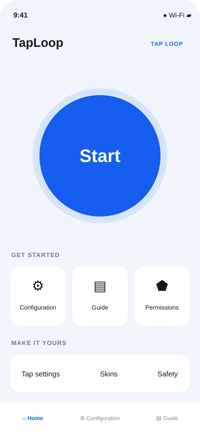
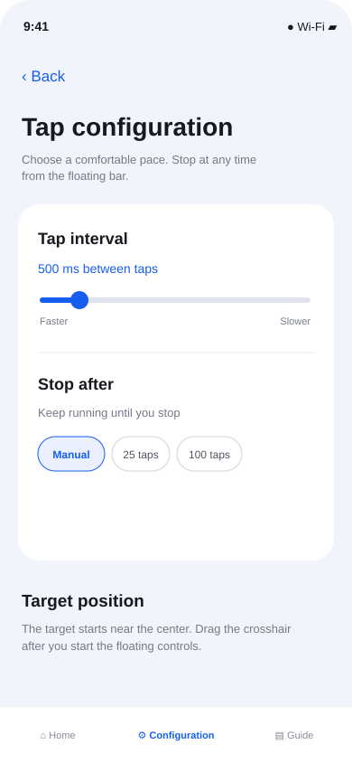
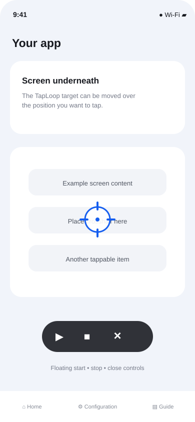

# TapLoop
### A lightweight Android auto-clicker prototype

An accessible, user-controlled floating tap tool inspired by the mobile app references shared for this project.

## What it does

- Repeats taps at one movable screen position.
- Lets you set the delay between taps and an optional tap-count limit.
- Puts a compact start, stop, and close bar above other apps.
- Uses Android's Accessibility Service gesture API to perform taps only after you press **Start**.
- Includes permission guidance, a quick guide, and a starter target-style screen.

## UI preview

These concept mockups show the current screen design. They are not captures from a running Android build; device screenshots will replace them once the app can be built and launched on a device.

### Home

### Tap settings

### Floating controls

## Get started

1. Open this folder in Android Studio and allow Gradle to sync.
2. Run the `app` configuration on an Android device or emulator running Android 8.0 (API 26) or later.
3. In TapLoop, open **Permissions** and enable the accessibility service and display-over-other-apps access in Android Settings.
4. Return to TapLoop and press **Start**.
5. Move the crosshair to the desired position and press **▶** on the floating control.
6. Press **■** to stop, or **×** to close the controls.

## Settings

Open **Configuration** to choose a tap interval (100–3000 ms) and a repeat limit. **Manual** keeps tapping until you stop it. The floating control stays visible while TapLoop is active.

## Built with

- Kotlin 2.0.21
- Jetpack Compose and Material 3
- Android Gradle Plugin 8.7.3
- Minimum Android version: Android 8.0 (API 26)

## Project status

This is an early prototype and has not yet been built or tested on a device. It currently supports one repeated tap target. Multi-point scripts, swipe recording, saved configurations, cloud sync, and additional target skins are future ideas.

## Privacy and control

The accessibility service is used to dispatch the gesture you request. This prototype does not read screen content or begin tapping automatically. Android displays an ongoing notification while the floating controls are active. You can stop tapping from the floating bar and revoke permissions in Android Settings.

Accessibility and overlay policies vary by Android version and distribution channel. Review the relevant requirements before publishing an app-store release.

## License

No license has been selected yet. Ask the project owner before reusing or redistributing this code.

